# Information protection

[:arrow_left: Home](./README.md)

In a perfect world, all your employees understand the importance of information protection and work within your policies. But in a real world, it's probable that a partner who works with accounting uploads a document to your Box repository with the wrong permissions, and a week later you realize that your enterprise's confidential information was leaked to your competition.
Microsoft Cloud App Security helps you prevent this kind of disaster before it happens.

In this task, you will protect a sensitive document library in SharePoint Online using the native integration with Azure Information Protection.

## Labs

* [Apply AIP classification to SSN documents:](Apply-AIP-classification-to-SSN-documents) :clock10: 10 min
* [Quarantine sensitive PDF for review:](Quarantine-sensitive-PDF-for-review) :clock10: 10 min
* [Test our policies:](Test-our-policies) :clock10: 10 min

---

## Apply AIP classification to SSN documents

[:arrow_up: Top](#Information-protection)

3.  Go to **Policies**.

	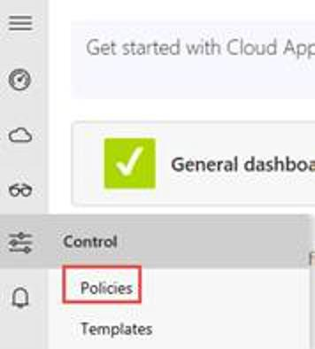
4.  Create a new **File policy**.

	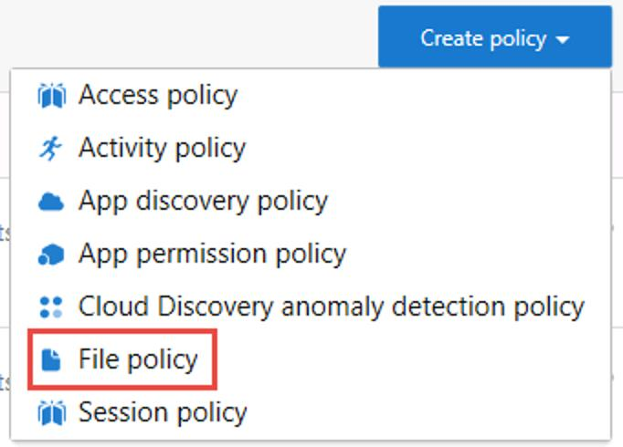
5.  Provide the following settings to that policy:
	1. Policy name: **Protect SSN documents in sensitive site**.
	1. Files matching all of the following: **remove the filters**.
	1. Apply to: **selected folder**.

	> NOTE: Here, select the **Shared Documents** folder from the default SharePoint site.
	
		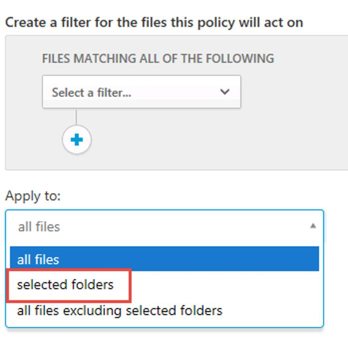

		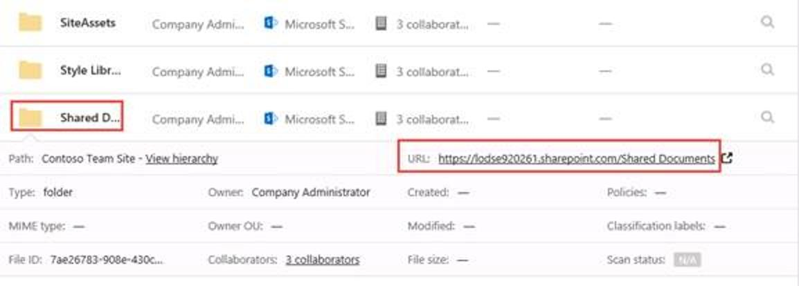
	1. Verify that you have one selected folder and click on **Done**.
	
		

		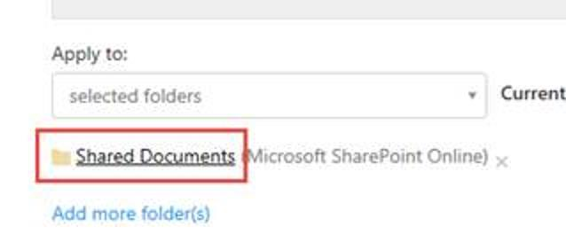
	1. In inspection method, select **Data Classification Service**.
	
		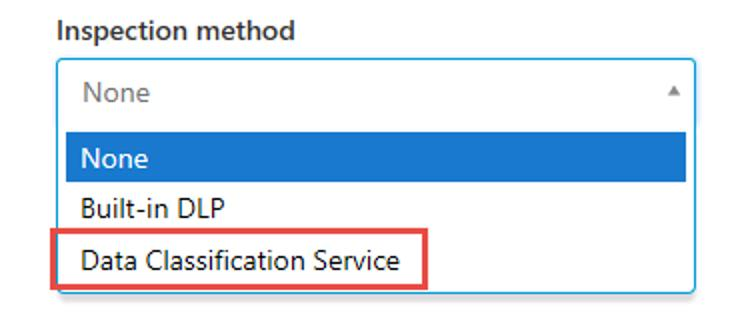
	1. Click on sensitive information type, select the **SSN related** ones and click on **Done**.
	
		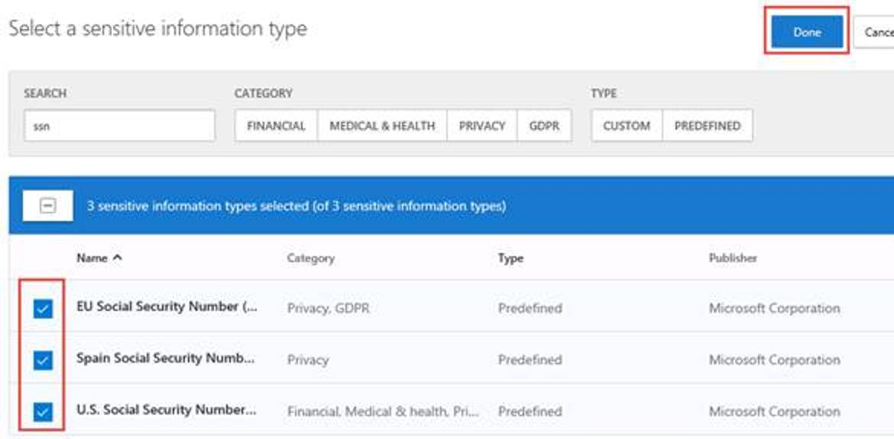
	1. Click on the **Unmask** checkbox.
	
		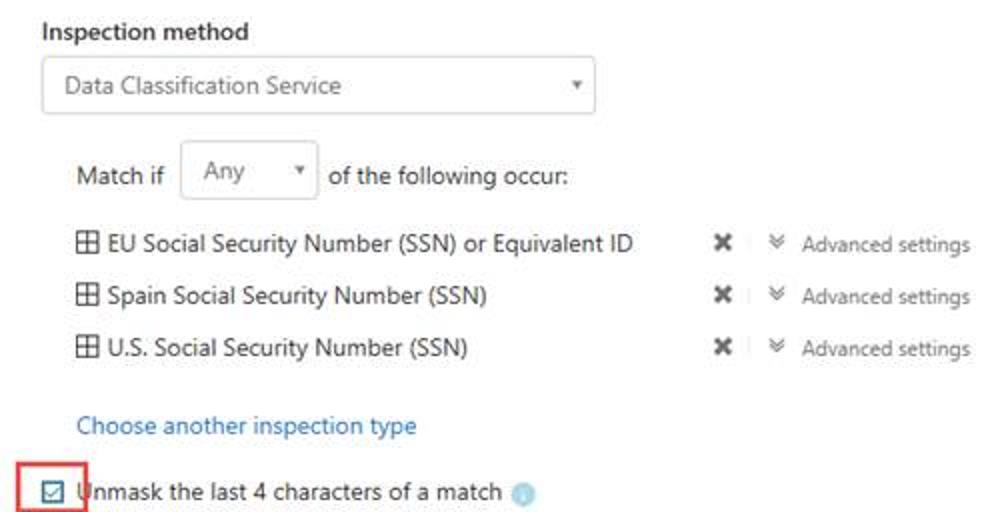
	1. In the Governance actions, select **Apply classification label**.

    >:memo: If you are not able to select Azure Information Protection templates, verify that you configured the integration in the prerequisites section.

		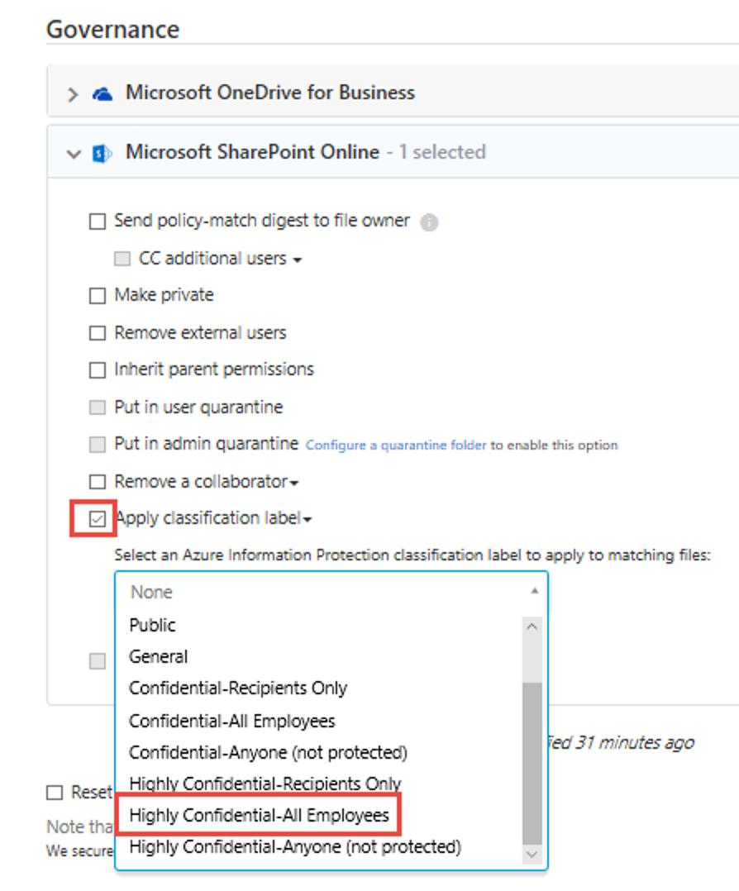
	1. Click **Create** to finish the policy creation.

---
## Quarantine sensitive PDF for review

[:arrow_up: Top](#Information-protection)

File policies are a great tool for finding threats to your information protection policies, for instance finding places where users stored sensitive information, credit card numbers and third-party ICAP files in your cloud. With Microsoft Cloud App Security, not only can you detect these unwanted files stored in your cloud that leave you vulnerable, but you can take immediate action to stop them in their tracks and lock down the files that pose a threat. Using Admin quarantine, you can protect your files in the cloud and remediate problems, as well as prevent future leaks from occurring.
This is what we are going to configure in this lab.

1. In Cloud App Security, go to the **Settings**.

	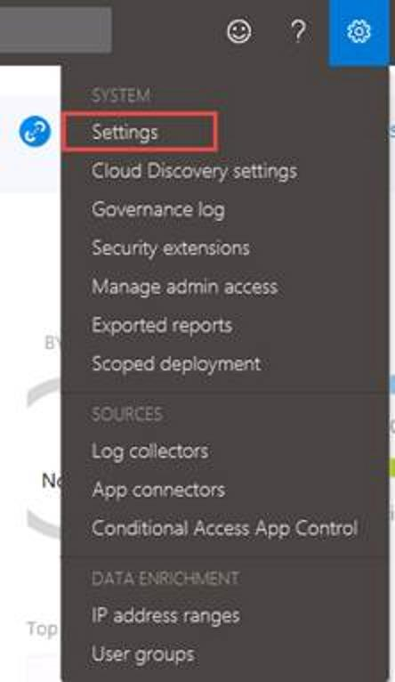
2.  In the Information Protection section, go to **Admin quarantine**.

	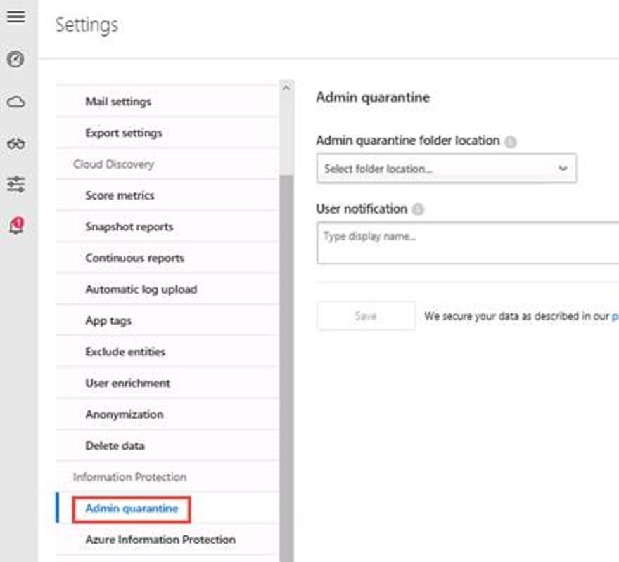
3.  In the dropdown menu, select your root SharePoint site.

	1. In user notification, type **Your content has been quarantined. Please contact your admin.**
	1. Click on the Save button.

    >:memo: As best practice, you should create and use a **dedicated** site with restricted access as the admin quarantine location.

	
4.  Next, go to the policies menu and create a new **file policy**.

	
5.  Provide the following settings to that policy:
	1. Policy name: **Quarantine sensitive pdf**
	1. Files matching all of the following: **Extension equals pdf**
	
	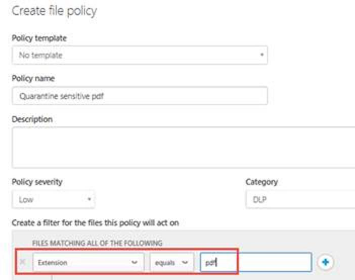
	1. In Governance actions, select **Put in admin quarantine** and click on the Create button.
	
	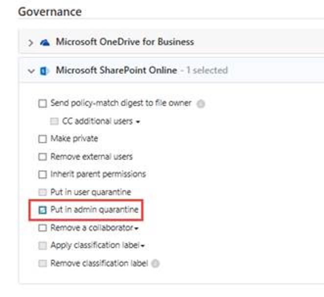

---

## Test our policies

[:arrow_up: Top](#Information-protection)

To test our files policies, perform the following tasks:

1. On Client01, unzip the content of the **Demo files.zip**.
7.  Go to the **Contoso Team Site** documents library.
8.  Upload the unzipped files to the site.

	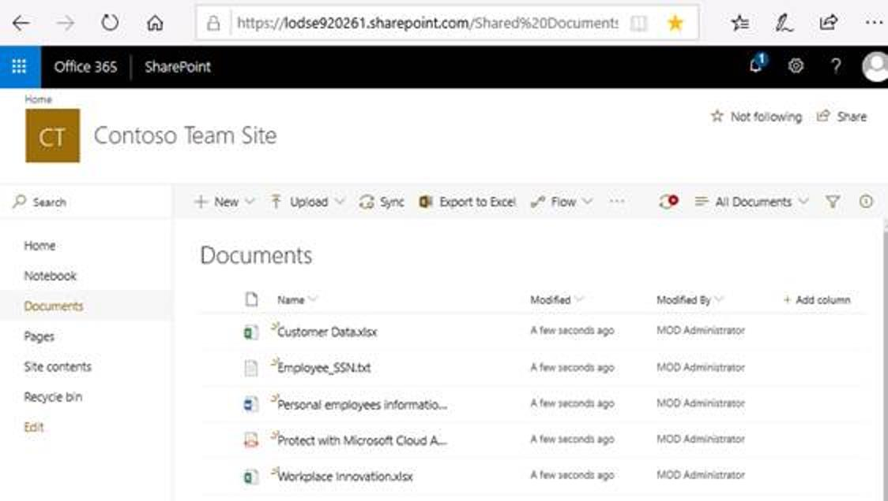
9.  Cloud App Security will now scan those documents and search for matches to our created policies. The scan can take some minutes before completion.
10.  To monitor the evolution, go back to Cloud App Security and open the **Files** page of the investigations.

	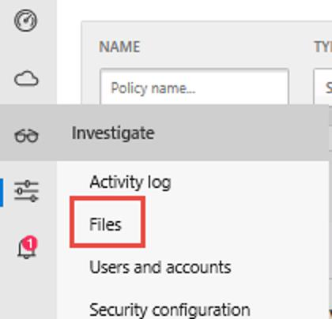
11. When a match is discovered, you will see it in this page.

	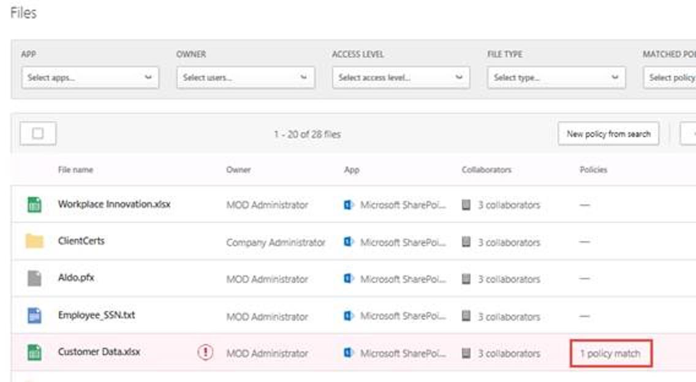
12.  Open the details of the file. You can see there the matched policies and the scan status of the files.

	
13.  You can also view the related governance actions in the Governance log.

	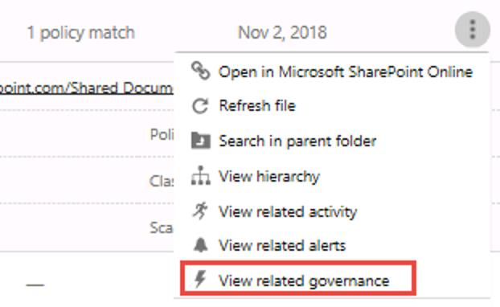
	
	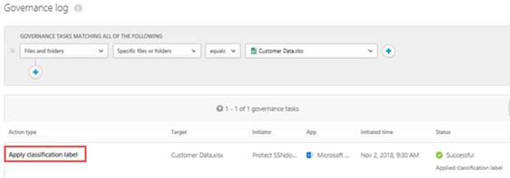

14.  You will also notice that the quarantined files will be replaced by placeholders containing your custom message and be moved to the "Quarantine" location we defined.

	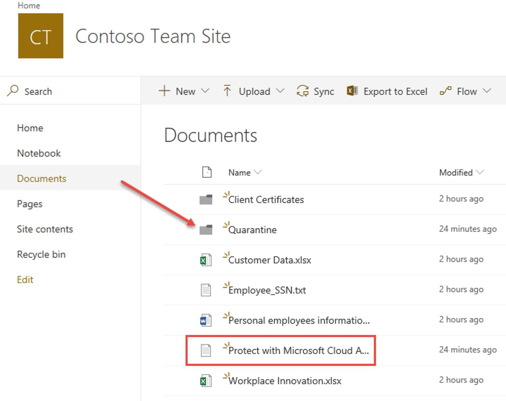

	

	
